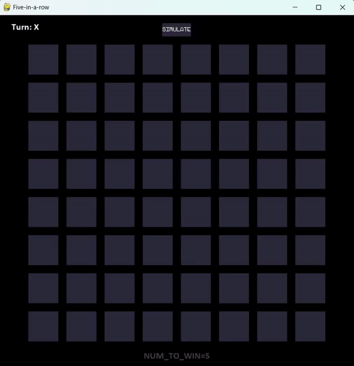
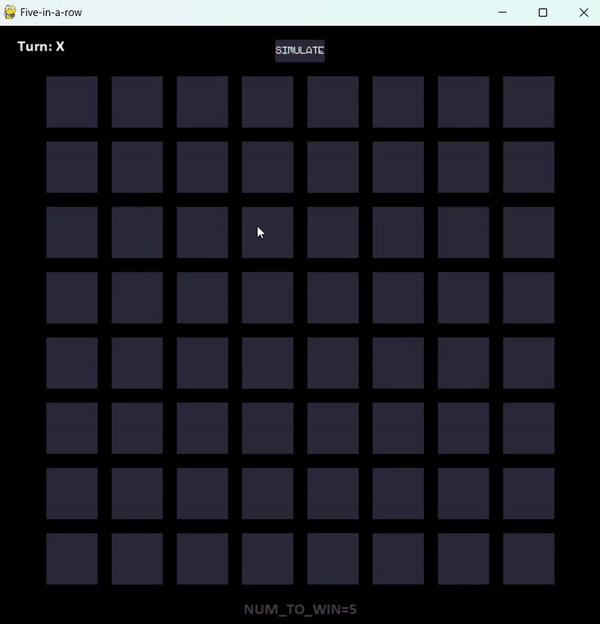
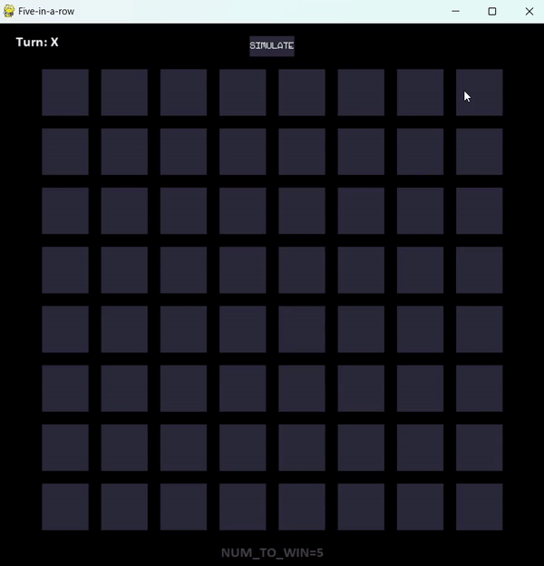

# Five-in-a-row

Game of tic tac toe with 5 symbols needed to win with a bot making choices depending on the minimax algorithm with alpha-beta prunning

It works on every number of symbols starting from 3. Sizes of the board for number of symbols equal to 3 or 4 are predefined. For games with number of symbols needed to win larger than 4, the player is able to adjust the size of the window (and the board) as he wishes.

---

# Options

- changing the size of the board before starting the game
- playing vs the bot
- simulating game of two bots by pressing a button
- changing the number of symbols needed to win

---

# Gifs - how it works

### Simulating the game of two bots



### Playing vs bot (1)



### Playing vs bot (2)



---

### Starting the game

```bash
pip install pygame
pip install termcolor
python main.py
```
